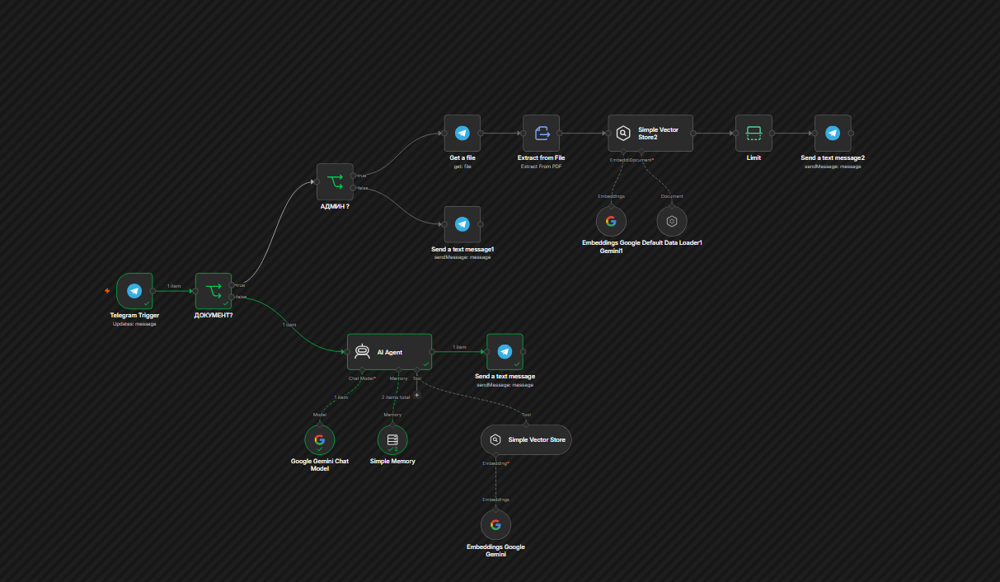

# Project 03 — Telegram AI Knowledge Base Bot (RAG)

---

## 📌 Overview

AI-powered Telegram chatbot built with n8n and Google Gemini.

The bot answers user questions using a Vector Store (RAG). Administrators can upload PDF documents directly through Telegram, and the bot immediately starts using the new information without modifying the workflow.

---

## 🎯 Goal

Create an AI assistant capable of answering questions based on a company's internal knowledge base while allowing administrators to update that knowledge directly from Telegram.

---

## ⚙️ Features

- AI-powered responses using Google Gemini
- Retrieval-Augmented Generation (RAG)
- Vector Store knowledge base
- PDF upload directly from Telegram
- Administrator-only document upload
- Automatic document processing
- Conversation memory
- Telegram Bot integration
- Docker deployment
- Built entirely in n8n

---

## 🔄 Workflow

1. User sends a message to the Telegram bot.
2. Workflow checks whether the message contains a document.
3. If it is a PDF and the sender is an administrator:
   - Download the file
   - Extract text
   - Generate embeddings
   - Save the document into the Vector Store
4. If it is a regular message:
   - AI Agent receives the question
   - Searches the Vector Store
   - Uses Google Gemini to generate an answer
   - Sends the response back to Telegram

---

## 🛠 Technologies

- n8n
- Google Gemini
- Google Embeddings
- AI Agent
- Simple Memory
- Simple Vector Store
- Telegram Bot API
- Docker

---

## 💼 Business Value

Allows companies to build an internal AI knowledge base without writing code.

Employees can ask questions in Telegram while administrators keep the knowledge base updated simply by uploading new PDF documents.

---

## 📚 Skills Learned

- AI Agent Development
- Retrieval-Augmented Generation (RAG)
- Vector Databases
- Google Gemini Integration
- Prompt Engineering
- Embeddings
- Telegram Bot Development
- Memory Management
- Docker Deployment
- AI Automation with n8n

---

## 📁 Files

- [workflow.json](workflow.json)

- README.md

---

## 🚀 Status

✅ Completed
